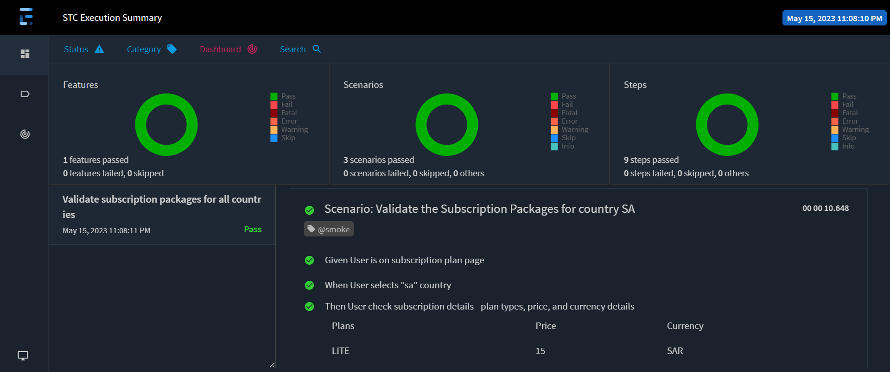
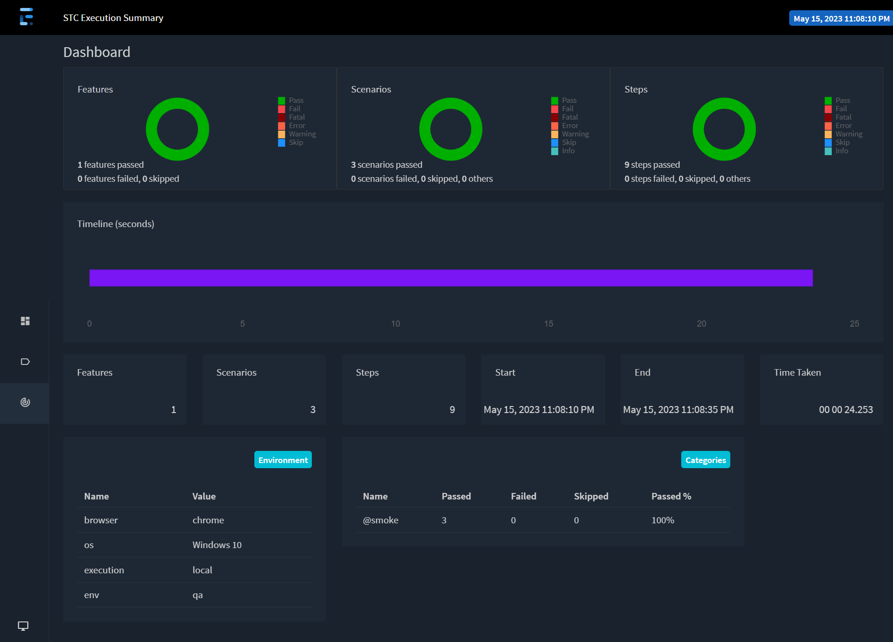
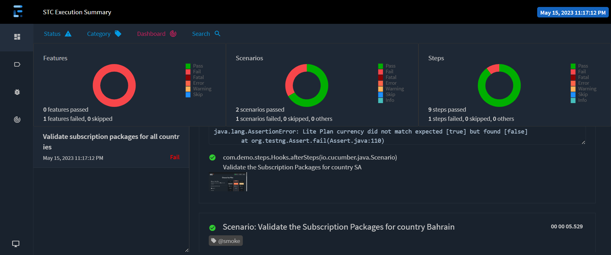

## Automation Test Framework - STCTV

The tech stacks used in this project are:
1. **JAVA** as the programming language for writing test code
2. **Cucumber** as the framework
3. **Maven** as the build tool
4. **IntelliJ** as the preferred IDE for writing java code.
5. **Docker** as selenium grid configuration using Docker compose

#### Getting Started
Set up your machine.
1. Install JDK 11
2. Install IntelliJ
3. Install Maven
4. Install Docker (To run it on selenium grid configuration)

#### Supporting browsers, execution platforms and parallel execution
* Browser:
  1. chrome
  2. firefox
  3. edge

* Execution:
  1. local
  2. docker

* Parallel Execution:
  1. On local
  2. On docker

#### Docker Configuration
* Start docker images using docker compose (Go to project root folder) and Run command : ```docker compose up```
* Scale up the docker images using command : ```docker-compose up --scale chrome=5 -d```

#### Running tests
* Run tests from command line:
  1. ```mvn clean test``` (To run tests on default configuration, browser=chrome, env=qa, execution=local, parallel=false)
  2. ```mvn clean test -Pfirefox,dev,docker``` (To run tests on specific configuration, browser=firefox, env=dev, execution=docker, parallel=false)
  3. ```mvn clean test -Pparallel``` (To run tests on default configuration with parallel=true)
  4. ```mvn clean test -Dcucumber.filter.tags=<tageName> cucumber.features=<featurefilename>``` (To run tests on specified cucumber tags and/or feature files)


* Run tests from IntelliJ:
    1. Open IntelliJ
    2. And select **testng.xml** ( select **testng_parallel.xml** for parallel execution)
    3. Now **right click** on it to run

#### Report
* Report will be found here: ```target/report/stc_report_html.html``` and ```target/report/stc_report_spark.html```
  1. Pass report format,
    

  

  2. Fail report format, (Attach screenshot of every failed cucumber steps)
  

---

### Tests

#### [Assignment 1]
1. **[Scenario-1](https://github.com/vinaykumarvvs/quiQUA/blob/master/src/test/resources/features/Assignment2.feature#L3):** Book a round trip flight from Bangalore to Delhi